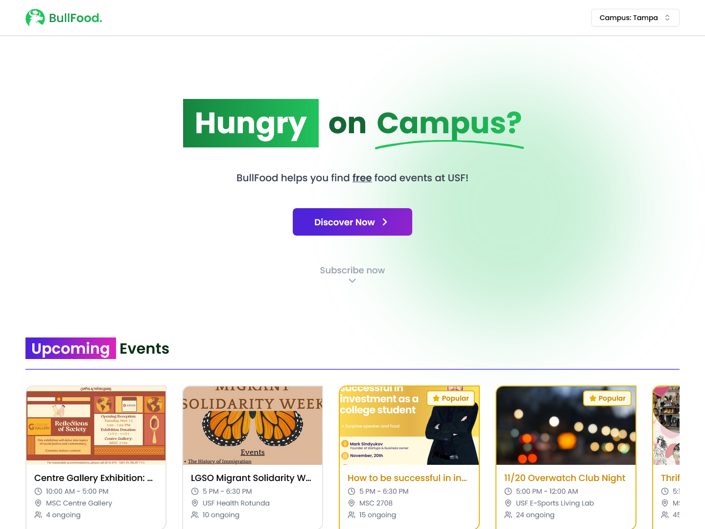

# [BullFood 🍔](https://bullfood.devltt.site/)

BullFood is a user-friendly website designed for students at the University of South Florida (USF) to discover and receive updates about free food events on campus.

[](https://bullfood.devltt.site/)

## Table of Contents

- [Tech Stack 🛠️](#tech-stack-🛠️)
- [Features 🚀](#features-🚀)
- [Running Locally 🧪](#running-locally-🧪)
  - [Prerequisites](#prerequisites)
  - [Steps](#steps)
    - [Step 1: Clone the Repository](#step-1-clone-the-repository)
    - [Step 2: Set Up the Client (Front-End)](#step-2-set-up-the-client-front-end)
    - [Step 3: Set Up the Server (Back-End)](#step-3-set-up-the-server-back-end)
    - [Step 4: Set Up the Services with Docker Compose](#step-4-set-up-the-services-with-docker-compose)
    - [Last Step: Run the Server](#last-step-run-the-server)

## Tech Stack 🛠️

- **Frontend:** [React](https://react.dev/) (with Typescript), [Redux](https://redux.js.org/), [TailwindCSS](https://tailwindcss.com/), [shadcn/ui](https://ui.shadcn.com/)
- **Backend:** [NestJS](https://nestjs.com/), [Express.js](https://expressjs.com/)
- **Databases:** [MongoDB](https://www.mongodb.com/), [Redis](https://redis.io/)
- **Message broker:** [RabbitMQ](https://www.rabbitmq.com/)
- **Deployment:** [AWS EC2](https://aws.amazon.com/ec2/), [Docker](https://www.docker.com/), [GitHub Actions](https://github.com/features/actions), [Vercel](https://vercel.com/)

## Features 🚀

- **Discover Free Food Events:** Browse a curated list of free food events on the USF campus.
- **Newsletter Subscription:** Subscribe to receive daily updates about featured food events.

## Running Locally 🧪

### Prerequisites

- [Node.js](https://nodejs.org/en)
- [Docker](https://www.docker.com/) (includes Docker Compose)

### Steps

#### Step 1: Clone the Repository

Clone the BullFood repository to your local machine: bash Copy code

```bash
git clone https://github.com/devltt404/bull-food
cd bull-food
```

#### Step 2: Set Up the Client (Front-End)

1. Navigate to the `client` folder:

   ```bash
   cd client
   ```

2. Install Dependencies

   ```bash
   npm i
   ```

3. Copy the `.env.example` to `.env`.

   ```bash
   cp .env.example .env
   ```

#### Step 3: Set Up the Server (Back-End)

1. Navigate to the `server` folder:

   ```bash
   cd ../server
   ```

2. Install client dependencies

   ```bash
   npm i
   ```

3. Setup env variables

   Copy the `.env.example` to `.env` and update the variables.

   ```bash
   cp .env.example .env
   ```

   You **must** provide values for `MAIL_USER` and `MAIL_PASS` in `.env` file to setup **Gmail SMTP**. These should be you Gmail email address and its [app password](https://support.google.com/mail/answer/185833?hl=en&ref_topic=3394217&sjid=5299481938873946335-NA). If you use another SMTP server other than **Gmail**, also update the values for `MAIL_HOST` and `MAIL_PORT`.

   > `BC_SESSION_ID` is optional. You can get its value by logging into https://bullsconnect.usf.edu/ and copying the value of `CG.SessionID` cookie.

#### Step 4: Set Up the Services with Docker Compose

We use **Docker Compose** to set up and run **MongoDB**, **Redis**, and **RabbitMQ** services locally.

1. Start services

   ```bash
   docker-compose up -d
   ```

2. Verify running Containers

   ```bash
   docker-compose ps
   ```

You should see the following services listed:

- **mongodb** on port `27017`
- **redis** on port `6379`
- **rabbitmq** on port `5672` and web UI on port `15672`

#### Last Step: Run the Server

```bash
npm run dev
```

Access the website through your browser at: [http://localhost:5173](http://localhost:5173)
